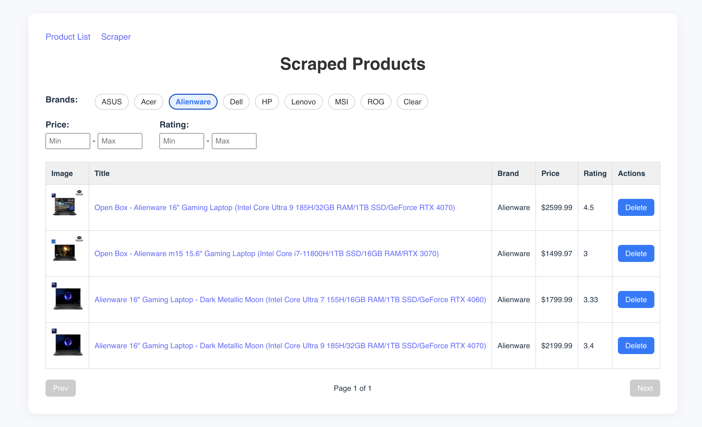

# Scraper App - BestBuy Product Scraper

A full-stack application that scrapes product data from BestBuy and displays it in a paginated frontend with filtering options. Built with **FastAPI + SQLModel + MySQL** on the backend and **React (Vite)** on the frontend.

## Features

- Product scraping from BestBuy (using Selenium)
- Paginated product listing
- Filter by brand, price range, and rating
- Delete product entries
- Start scraper on demand
- MySQL database for persistent storage




## Quick Start with Docker

```bash
docker-compose up --build
```

Access:

Frontend: http://localhost:3001

Backend API: http://localhost:8001

## Manual Local Setup (Dev Mode)

### 1. backend:
   
```bash
cd backend

pip install -r requirements.txt

python ./app/main.py
```

### 2. frontend:

```bash
cd scraper-frontend

npm install

npm run dev
```

### 3. MySQL:

Make sure a local MySQL instance is running with these credentials (or update .env on local machine):

```
MYSQL_USER=root
MYSQL_PASSWORD=root
MYSQL_DATABASE=db
MYSQL_HOST=localhost
MYSQL_PORT=3306
```

**init_db.sql** is under ./backend/

Access:

Frontend: http://localhost:3001

Backend API: http://localhost:8001

